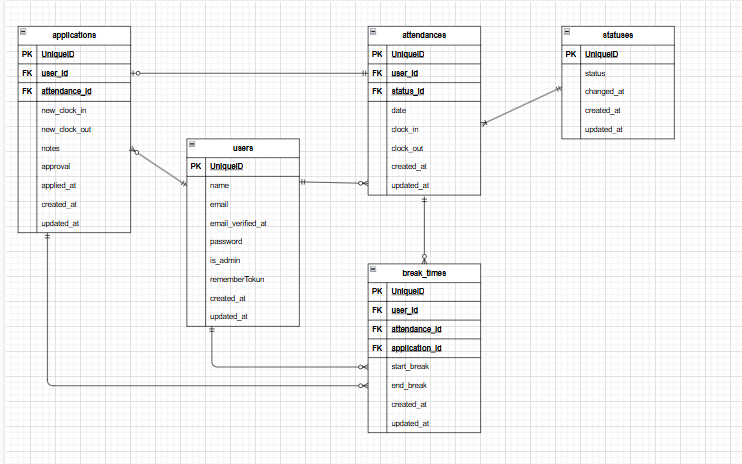

# attendance_management

## サービス概要

現在競合他社で展開している勤怠アプリは、機能や画面が複雑で使いにくい仕様になっているものが多くあります。  
そこでシンプルで直感的に使うことができる勤怠アプリを作成しました。

## サービス内容

- fortfy による認証機能（mailhog によるメール認証）
- 管理者による勤怠確認、修正、承認、勤怠一覧の CSV 出力
- ユーザーによる勤怠打刻、勤怠確認、修正

## 環境構築

### Docker ビルド

1.

```bash
git clone https://github.com/kenta-10043/attendance_management.git
```

2.

```bash
make init
```

\*プロジェクト直下のディレクトリで実行してください。  
\*MySQL は、OS によって起動しない場合があるのでそれぞれの PC に合わせて docker-compose.yml ファイルを編集してください。

### Laravel 環境構築

1.env.example ファイルから.env を作成し、環境変数を変更

```bash
cp .env.example .env
```

| 設定項目    | 変更前    | 変更後       |
| ----------- | --------- | ------------ |
| DB_HOST     | 127.0.0.1 | mysql        |
| DB_DATABASE | laravel   | laravel_db   |
| DB_USERNAME | root      | laravel_user |
| DB_PASSWORD | ー        | laravel_pass |

2.マイグレーションの実行

```bash
php artisan migrate
```

- php artisan migrate 実行時に DB エラーが発生した場合は以下のコマンドで volume を削除して再構築してください。

```bash
docker-compose down -v  # volume 削除 DB 初期化
docker-compose up -d
```

3.シーディングの実行

```bash
php artisan db:seed
```

4.テストを実行する際は.test.env ファイルを作成

```bash
cp .env .env.testing
```

| 設定項目       | 変更前       | 変更後     |
| -------------- | ------------ | ---------- |
| APP_ENV        | local        | testing    |
| DB_CONNECTION  | mysql        | mysql_test |
| DB_DATABASE    | laravel_db   | demo_test  |
| DB_USERNAME    | laravel_user | root       |
| DB_PASSWORD    | laravel_user | root       |
| CACHE_DRIVER   | file         | array      |
| SESSION_DRIVER | file         | array      |
| MAIL_MAILER    | smtp         | log        |

### テスト実行手順

- demo_test データベース作成

```bash
docker-compose exec mysql bash
```

```sql
mysql -u root -p
```

```sql
CREATE DATABASE demo_test;
```

- テスト用テーブル作成

```bash
php artisan migrate --env=testing
```

- php artisan migrate --env=testing 実行時に DB エラーが発生した場合は以下のコマンドで volume を削除して再構築してください。

```bash
docker-compose down -v  # volume 削除 DB 初期化
docker-compose up -d
```

- テスト実行

```bash
php artisan test --env=testing
```

## 使用技術

- PHP 8.3-fpm
- Laravel 10.48.29
- MySQL 8.0.34
- fortify \* v1.28.0
- mailhog

## テーブル仕様

- users テーブル

|     カラム名      |      型      | primary key | unique key | not null | foreign key |
| :---------------: | :----------: | :---------: | :--------: | :------: | :---------: |
|        id         |   bigint.    |      ◯      |            |    ◯     |             |
|       name        | varchar(255) |             |            |    ◯     |             |
|       email       | varchar(255) |             |     　     |    ◯     |             |
| email_verified_at |  timestamp   |             |            |          |             |
|     password      | varchar(255) |             |     〇     |    〇    |             |
|     is_admin      |   boolean    |             |            |          |             |
|  remember_token   | varchar(100) |             |            |          |             |
|    created_at     |  timestamp   |             |            |          |             |
|    updated_at     |  timestamp   |             |            |          |             |

- attendaces テーブル

|  カラム名  |    型     | primary key | unique key | not null | foreign key  |
| :--------: | :-------: | :---------: | :--------: | :------: | :----------: |
|     id     |  bigint   |      ◯      |            |    ◯     |              |
|  user_id   |  bigint   |             |            |    ◯     |  users(id)   |
| status_id  |  bigint   |             |            |    ◯     | statuses(id) |
|  clock_in  | datetime  |             |            |          |              |
| clock_out  | datetime  |             |            |          |              |
|    date    |   date    |             |            |          |              |
| created_at | timestamp |             |            |          |              |
| updated_at | timestamp |             |            |          |              |

- break_times テーブル

|    カラム名    |    型     | primary key | unique key | not null |   foreign key    |
| :------------: | :-------: | :---------: | :--------: | :------: | :--------------: |
|       id       |  bigint   |      ◯      |            |    ◯     |                  |
|    user_id     |  bigint   |             |            |    ◯     |    users(id)     |
| attendance_id  |  bigint   |             |            |    ◯     | attendances(id)  |
| application_id |  bigint   |             |            |          | applications(id) |
|  start_break   | datetime  |             |            |          |                  |
|   end_break    | datetime  |             |            |          |                  |
|   created_at   | timestamp |             |            |          |                  |
|   updated_at   | timestamp |             |            |          |                  |

- applications テーブル

|   カラム名    |      型      | primary key | unique key | not null |   foreign key   |
| :-----------: | :----------: | :---------: | :--------: | :------: | :-------------: |
|      id       |    bigint    |      ◯      |            |    ◯     |                 |
|    user_id    |    bigint    |             |            |    ◯     |    users(id)    |
| attendance_id |    bigint    |             |            |    ◯     | attendances(id) |
| new_clock_in  |   datetime   |             |            |          |                 |
| new_clock_out |   datetime   |             |            |          |                 |
|   approval    |   tinyint    |             |            |    ◯     |                 |
|   notes 　    | varchar(255) |             |            |    ◯     |                 |
| applied_at 　 |   datetime   |             |            |    ◯     |                 |
|  created_at   |  timestamp   |             |            |          |                 |
|  updated_at   |  timestamp   |             |            |          |                 |

- statuses テーブル

|  カラム名  |    型     | primary key | unique key | not null | foreign key |
| :--------: | :-------: | :---------: | :--------: | :------: | :---------: |
|     id     |  bigint   |      ◯      |            |    ◯     |             |
|   status   |  tinyint  |             |            |    ◯     |             |
| changed_at | datetime  |             |            |    ◯     |             |
| created_at | timestamp |             |            |          |             |
| updated_at | timestamp |             |            |          |             |

## ER 図



## 開発環境

- 勤怠登録：http://localhost/attendance
- ユーザー登録：http://localhost/register
- ユーザーログイン：http://localhost/login
- 管理者ログイン：http://localhost/admin/login
- phpMyAdmin：http://localhost:8080/

## ログイン情報

### 管理者ユーザー

- email:admmin@example.com
- password:password

### 一般ユーザー

- email:user@example.com
- password:password

  *is_admin によって管理者・一般ユーザーを区別しています。  
  *seeder で一般ユーザーのデータを入れています。こちらは勤怠確認用  
   になります。勤怠打刻を確認する場合はユーザー登録から新規ユーザー  
   登録をお願いいたします。 \*申請リストは遷移した直後は承認待ち、承認済みの両方が表示されるようにしています。  
  その後タブで割り振られます。
